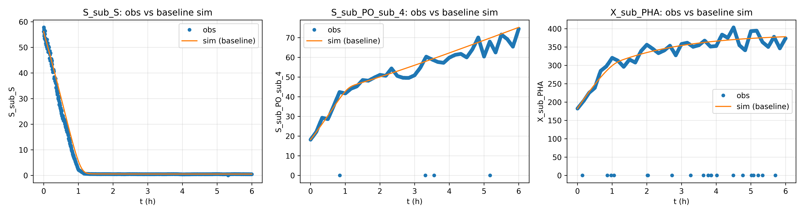
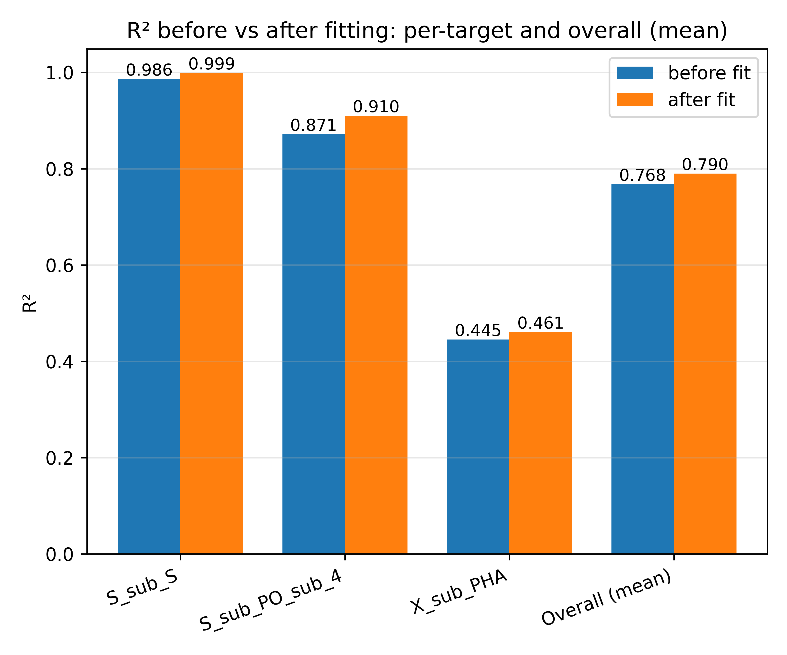
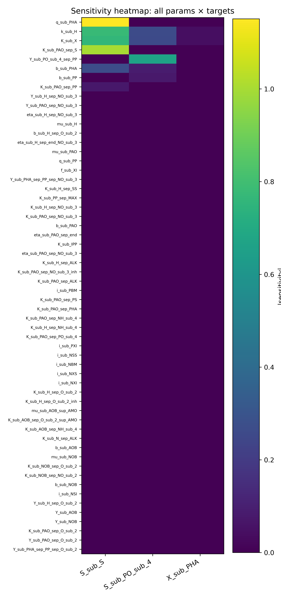
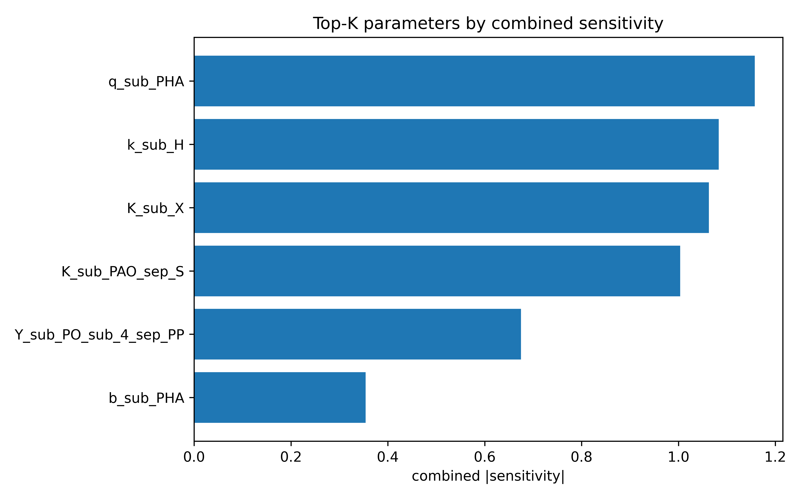
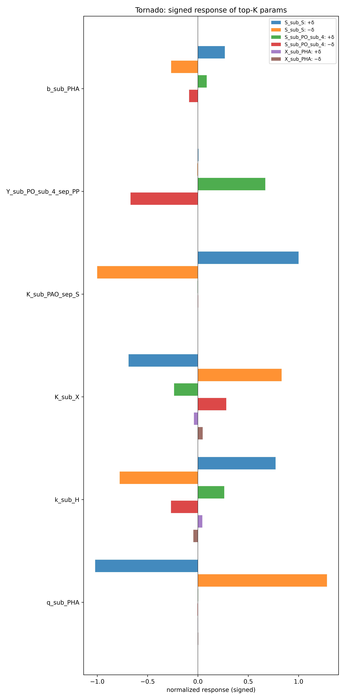
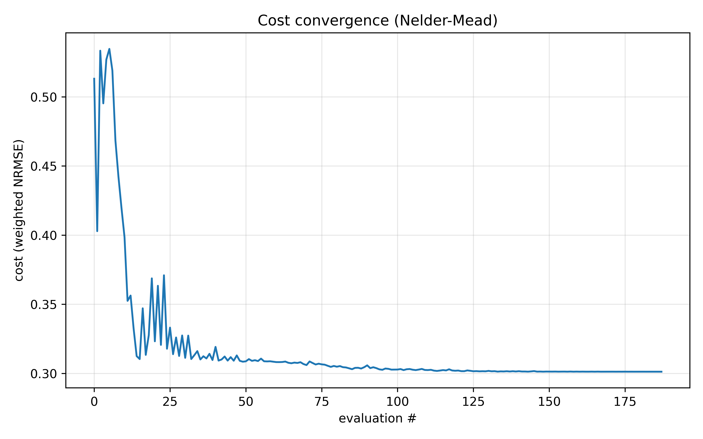
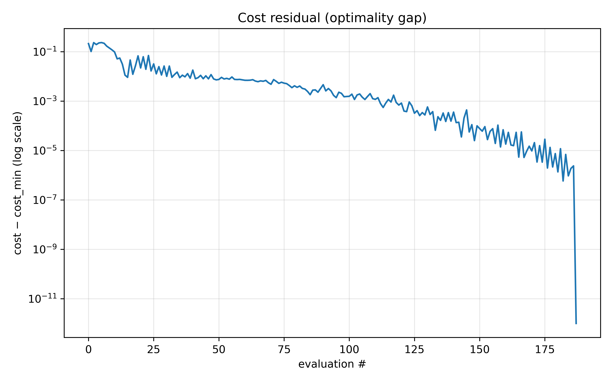
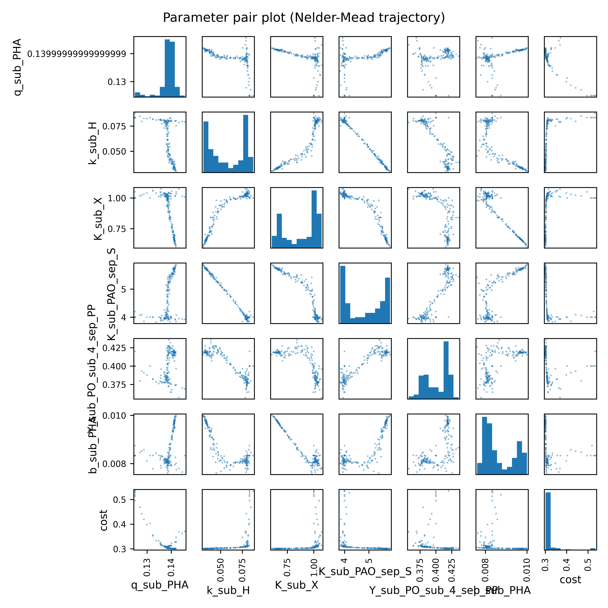

# ASM Mechanistic Modeling Report (9-Step Workflow + Effect Analysis)

This report is generated from `midoutput/asm_config.json`, `midoutput/sensitivity.json`, and `midoutput/calibration.json`. All executable model definitions come from `script/asmlibrary.py`.

## 1. Define Model Boundaries

The selected modelcomplex is **EBPRCODN**. Simplified COD-N plus biological phosphorus removal model with 17 components and 18 reactions.

The reactor basis is a single completely stirred tank reactor (CSTR). Biological reaction terms define the internal conversion rates, while optional boundary source/sink terms are injected through the `boundaries` argument of `run_pipeline`.

### 1.1 Enabled Boundary Source/Sink Terms

| Boundary | Configuration | Interpretation |
|---|---|---|
| `ras_recycle` | `k_RAS`=0.5, `factor`=2 | Return activated sludge effect on particulate X_sub_* components. |

## 2. Define State Components

The ODE state vector contains **17** active components for `EBPRCODN`. Soluble components use the `S_sub_*` prefix and particulate components use the `X_sub_*` prefix.

| # | Component | Formula label | Meaning | Unit | Role |
|---:|---|---|---|---|---|
| 1 | `S_sub_S` | S_S | readily biodegradable soluble COD | mg COD/L | Direct heterotrophic substrate and PAO anaerobic carbon source. |
| 2 | `S_sub_I` | S_I | inert soluble COD | mg COD/L | Soluble organic matter that is not biologically converted. |
| 3 | `X_sub_S` | X_S | slowly biodegradable particulate COD | mg COD/L | Particulate substrate that must hydrolyze before uptake. |
| 4 | `X_sub_I` | X_I | inert particulate COD | mg COD/L | Non-biodegradable particulate organic matter. |
| 5 | `S_sub_NH_sub_4` | S_NH_4 | ammonium nitrogen | mg N/L | Substrate for nitrification and nitrogen source for biomass synthesis. |
| 6 | `S_sub_NO_sub_2` | S_NO_2 | nitrite nitrogen | mg N/L | AOB product, NOB substrate, and denitrification electron acceptor. |
| 7 | `S_sub_NO_sub_3` | S_NO_3 | nitrate nitrogen | mg N/L | NOB product and common denitrification electron acceptor. |
| 8 | `S_sub_N_sub_2` | S_N_2 | nitrogen gas | mg N/L | Final denitrification product. |
| 9 | `S_sub_O_sub_2` | S_O_2 | dissolved oxygen | mg O2/L | Electron acceptor for aerobic reactions and aeration target. |
| 10 | `S_sub_ALK` | S_ALK | alkalinity | mol HCO3-/m3 | pH-buffering capacity affected by nitrification and biomass growth. |
| 11 | `X_sub_H` | X_H | heterotrophic biomass | mg COD/L | Biomass responsible for COD removal and denitrification. |
| 12 | `X_sub_AOB` | X_AOB | ammonia-oxidizing bacteria | mg COD/L | Autotrophic biomass for ammonia oxidation. |
| 13 | `X_sub_NOB` | X_NOB | nitrite-oxidizing bacteria | mg COD/L | Autotrophic biomass for nitrite oxidation. |
| 14 | `S_sub_PO_sub_4` | S_PO_4 | orthophosphate | mg P/L | Soluble phosphorus released and taken up in EBPR. |
| 15 | `X_sub_PP` | X_PP | polyphosphate | mg P/L | Intracellular phosphorus storage in PAOs. |
| 16 | `X_sub_PAO` | X_PAO | polyphosphate-accumulating organisms | mg COD/L | Biomass that drives EBPR. |
| 17 | `X_sub_PHA` | X_PHA | polyhydroxyalkanoate | mg COD/L | PAO storage polymer formed under anaerobic substrate uptake. |

## 3. Determine Biochemical Reactions

The selected model activates **18** reactions. The table summarizes each active reaction by reaction ID, category, consumed components, and produced components.

| Reaction ID | Category | Substrates | Products |
|---|---|---|---|
| `S1` | biochemical reaction | `S_sub_S` | `X_sub_S` |
| `S2` | biochemical reaction | `X_sub_H` | `S_sub_S`, `S_sub_O_sub_2`, `S_sub_NH_sub_4`, `S_sub_ALK` |
| `S3` | biochemical reaction | `S_sub_N_sub_2`, `S_sub_ALK`, `X_sub_H` | `S_sub_S`, `S_sub_NO_sub_3`, `S_sub_NH_sub_4` |
| `S4` | biochemical reaction | `S_sub_NH_sub_4`, `S_sub_ALK`, `X_sub_I` | `S_sub_O_sub_2`, `X_sub_H` |
| `S5` | biochemical reaction | `S_sub_NH_sub_4`, `S_sub_N_sub_2`, `S_sub_ALK`, `X_sub_I` | `S_sub_NO_sub_3`, `X_sub_H` |
| `S6` | biochemical reaction | `S_sub_NO_sub_2`, `X_sub_AOB` | `S_sub_NH_sub_4`, `S_sub_O_sub_2`, `S_sub_ALK` |
| `S7` | biochemical reaction | `S_sub_NO_sub_3`, `X_sub_NOB` | `S_sub_NH_sub_4`, `S_sub_NO_sub_2`, `S_sub_ALK`, `S_sub_O_sub_2` |
| `S8` | biochemical reaction | `S_sub_NH_sub_4`, `S_sub_ALK`, `X_sub_I` | `S_sub_O_sub_2`, `X_sub_AOB` |
| `S9` | biochemical reaction | `S_sub_NH_sub_4`, `S_sub_ALK`, `X_sub_I` | `S_sub_O_sub_2`, `X_sub_NOB` |
| `P33` | biochemical reaction | `S_sub_PO_sub_4`, `X_sub_PHA`, `S_sub_NH_sub_4`, `S_sub_ALK` | `S_sub_S`, `X_sub_PP` |
| `P34` | biochemical reaction | `X_sub_PP` | `S_sub_PO_sub_4`, `X_sub_PHA`, `S_sub_O_sub_2` |
| `P35` | biochemical reaction | `X_sub_PP`, `S_sub_N_sub_2`, `S_sub_ALK` | `S_sub_PO_sub_4`, `X_sub_PHA`, `S_sub_NO_sub_3` |
| `P36` | biochemical reaction | `X_sub_PAO` | `S_sub_NH_sub_4`, `S_sub_PO_sub_4`, `S_sub_O_sub_2`, `X_sub_PHA`, `S_sub_ALK` |
| `P37` | biochemical reaction | `S_sub_N_sub_2`, `X_sub_PAO`, `S_sub_ALK` | `S_sub_NH_sub_4`, `S_sub_PO_sub_4`, `S_sub_NO_sub_3`, `X_sub_PHA` |
| `P38` | biochemical reaction | `S_sub_NH_sub_4`, `S_sub_PO_sub_4`, `X_sub_I`, `S_sub_ALK` | `S_sub_O_sub_2`, `X_sub_PAO` |
| `P39` | biochemical reaction | `S_sub_NH_sub_4`, `S_sub_PO_sub_4`, `S_sub_N_sub_2`, `X_sub_I`, `S_sub_ALK` | `S_sub_NO_sub_3`, `X_sub_PAO` |
| `P40` | biochemical reaction | `S_sub_PO_sub_4` | `X_sub_PP` |
| `P41` | biochemical reaction | `S_sub_S` | `X_sub_PHA`, `S_sub_NH_sub_4`, `S_sub_ALK` |

## 4. Build the Stoichiometric Matrix

The stoichiometric matrix has **18 reactions x 17 components**. Positive coefficients produce a component, negative coefficients consume a component, and zeros are omitted from the compact table.

| Reaction | Component | Stoichiometric coefficient |
|---|---|---:|
| `S1` | `S_sub_S` | `1 - f_sub_SI` |
| `S1` | `S_sub_I` | `f_sub_SI` |
| `S1` | `S_sub_NH_sub_4` | `i_sub_NXS - f_sub_SI * i_sub_NSI - (1 - f_sub_SI) * i_sub_NSS` |
| `S1` | `S_sub_ALK` | `(i_sub_NXS - f_sub_SI * i_sub_NSI - (1 - f_sub_SI) * i_sub_NSS) / 14` |
| `S1` | `X_sub_S` | `-1` |
| `S2` | `S_sub_S` | `-1 / Y_sub_H_sep_O_sub_2` |
| `S2` | `S_sub_O_sub_2` | `-(1 - Y_sub_H_sep_O_sub_2) / Y_sub_H_sep_O_sub_2` |
| `S2` | `S_sub_NH_sub_4` | `-i_sub_NBM` |
| `S2` | `S_sub_ALK` | `-i_sub_NBM / 14` |
| `S2` | `X_sub_H` | `1` |
| `S3` | `S_sub_S` | `-1 / Y_sub_H_sep_NO_sub_3` |
| `S3` | `S_sub_NO_sub_3` | `-(1 - Y_sub_H_sep_NO_sub_3) / (2.8571 * Y_sub_H_sep_NO_sub_3)` |
| `S3` | `S_sub_N_sub_2` | `(1 - Y_sub_H_sep_NO_sub_3) / (2.8571 * Y_sub_H_sep_NO_sub_3)` |
| `S3` | `S_sub_NH_sub_4` | `-i_sub_NBM` |
| `S3` | `S_sub_ALK` | `((1 - Y_sub_H_sep_NO_sub_3) / (2.8571 * Y_sub_H_sep_NO_sub_3) - i_sub_NBM) / 14` |
| `S3` | `X_sub_H` | `1` |
| `S4` | `S_sub_NH_sub_4` | `-f_sub_XI * i_sub_NXI + i_sub_NBM` |
| `S4` | `S_sub_ALK` | `(-f_sub_XI * i_sub_NXI + i_sub_NBM) / 14` |
| `S4` | `S_sub_O_sub_2` | `-1 + f_sub_XI` |
| `S4` | `X_sub_I` | `f_sub_XI` |
| `S4` | `X_sub_H` | `-1` |
| `S5` | `S_sub_NH_sub_4` | `-f_sub_XI * i_sub_NXI + i_sub_NBM` |
| `S5` | `S_sub_NO_sub_3` | `-(1 - f_sub_XI) / 2.8571` |
| `S5` | `S_sub_N_sub_2` | `(1 - f_sub_XI) / 2.8571` |
| `S5` | `S_sub_ALK` | `(-f_sub_XI * i_sub_NXI + i_sub_NBM + (1 - f_sub_XI) / 2.8571) / 14` |
| `S5` | `X_sub_I` | `f_sub_XI` |
| `S5` | `X_sub_H` | `-1` |
| `S6` | `S_sub_NH_sub_4` | `-1 / Y_sub_AOB - i_sub_NBM` |
| `S6` | `S_sub_NO_sub_2` | `1 / Y_sub_AOB` |
| `S6` | `S_sub_O_sub_2` | `-(3.4286 - Y_sub_AOB) / Y_sub_AOB` |
| `S6` | `S_sub_ALK` | `-(2 / Y_sub_AOB + i_sub_NBM) / 14` |
| `S6` | `X_sub_AOB` | `1` |
| `S7` | `S_sub_NH_sub_4` | `-i_sub_NBM` |
| `S7` | `S_sub_NO_sub_2` | `-1 / Y_sub_NOB` |
| `S7` | `S_sub_NO_sub_3` | `1 / Y_sub_NOB` |
| `S7` | `S_sub_ALK` | `-i_sub_NBM / 14` |
| `S7` | `S_sub_O_sub_2` | `-1.1429 / Y_sub_NOB + 1` |
| `S7` | `X_sub_NOB` | `1` |
| `S8` | `S_sub_NH_sub_4` | `-f_sub_XI * i_sub_NXI + i_sub_NBM` |
| `S8` | `S_sub_ALK` | `(-f_sub_XI * i_sub_NXI + i_sub_NBM) / 14` |
| `S8` | `S_sub_O_sub_2` | `-1 + f_sub_XI` |
| `S8` | `X_sub_I` | `f_sub_XI` |
| `S8` | `X_sub_AOB` | `-1` |
| `S9` | `S_sub_NH_sub_4` | `-f_sub_XI * i_sub_NXI + i_sub_NBM` |
| `S9` | `S_sub_ALK` | `(-f_sub_XI * i_sub_NXI + i_sub_NBM) / 14` |
| `S9` | `S_sub_O_sub_2` | `-1 + f_sub_XI` |
| `S9` | `X_sub_I` | `f_sub_XI` |
| `S9` | `X_sub_NOB` | `-1` |
| `P33` | `S_sub_S` | `-1` |
| `P33` | `S_sub_PO_sub_4` | `Y_sub_PO_sub_4_sep_PP` |
| `P33` | `X_sub_PP` | `-Y_sub_PO_sub_4_sep_PP` |
| `P33` | `X_sub_PHA` | `1` |
| `P33` | `S_sub_NH_sub_4` | `i_sub_NSS` |
| `P33` | `S_sub_ALK` | `i_sub_NSS / 14` |
| `P34` | `S_sub_PO_sub_4` | `-1` |
| `P34` | `X_sub_PP` | `1` |
| `P34` | `X_sub_PHA` | `-Y_sub_PHA_sep_PP_sep_O_sub_2` |
| `P34` | `S_sub_O_sub_2` | `-Y_sub_PHA_sep_PP_sep_O_sub_2` |
| `P35` | `S_sub_PO_sub_4` | `-1` |
| `P35` | `X_sub_PP` | `1` |
| `P35` | `X_sub_PHA` | `-Y_sub_PHA_sep_PP_sep_NO_sub_3` |
| `P35` | `S_sub_NO_sub_3` | `-Y_sub_PHA_sep_PP_sep_NO_sub_3 / 2.8571` |
| `P35` | `S_sub_N_sub_2` | `Y_sub_PHA_sep_PP_sep_NO_sub_3 / 2.8571` |
| `P35` | `S_sub_ALK` | `(Y_sub_PHA_sep_PP_sep_NO_sub_3 / 2.8571) / 14` |
| `P36` | `S_sub_NH_sub_4` | `-i_sub_NBM` |
| `P36` | `S_sub_PO_sub_4` | `-i_sub_PBM` |
| `P36` | `S_sub_O_sub_2` | `-1 / Y_sub_PAO_sep_O_sub_2 + 1` |
| `P36` | `X_sub_PHA` | `-1 / Y_sub_PAO_sep_O_sub_2` |
| `P36` | `X_sub_PAO` | `1` |
| `P36` | `S_sub_ALK` | `-i_sub_NBM / 14` |
| `P37` | `S_sub_NH_sub_4` | `-i_sub_NBM` |
| `P37` | `S_sub_PO_sub_4` | `-i_sub_PBM` |
| `P37` | `S_sub_NO_sub_3` | `-(1 / Y_sub_PAO_sep_NO_sub_3 - 1) / 2.8571` |
| `P37` | `S_sub_N_sub_2` | `(1 / Y_sub_PAO_sep_NO_sub_3 - 1) / 2.8571` |
| `P37` | `X_sub_PHA` | `-1 / Y_sub_PAO_sep_NO_sub_3` |
| `P37` | `X_sub_PAO` | `1` |
| `P37` | `S_sub_ALK` | `((1 / Y_sub_PAO_sep_NO_sub_3 - 1) / 2.8571 - i_sub_NBM) / 14` |
| `P38` | `S_sub_NH_sub_4` | `-f_sub_XI * i_sub_NXI + i_sub_NBM` |
| `P38` | `S_sub_PO_sub_4` | `-f_sub_XI * i_sub_PXI + i_sub_PBM` |
| `P38` | `S_sub_O_sub_2` | `-1 + f_sub_XI` |
| `P38` | `X_sub_I` | `f_sub_XI` |
| `P38` | `X_sub_PAO` | `-1` |
| `P38` | `S_sub_ALK` | `(-f_sub_XI * i_sub_NXI + i_sub_NBM) / 14` |
| `P39` | `S_sub_NH_sub_4` | `-f_sub_XI * i_sub_NXI + i_sub_NBM` |
| `P39` | `S_sub_PO_sub_4` | `-f_sub_XI * i_sub_PXI + i_sub_PBM` |
| `P39` | `S_sub_NO_sub_3` | `-(1 - f_sub_XI) / 2.8571` |
| `P39` | `S_sub_N_sub_2` | `(1 - f_sub_XI) / 2.8571` |
| `P39` | `X_sub_I` | `f_sub_XI` |
| `P39` | `X_sub_PAO` | `-1` |
| `P39` | `S_sub_ALK` | `(-f_sub_XI * i_sub_NXI + i_sub_NBM + (1 - f_sub_XI) / 2.8571) / 14` |
| `P40` | `S_sub_PO_sub_4` | `1` |
| `P40` | `X_sub_PP` | `-1` |
| `P41` | `S_sub_S` | `1` |
| `P41` | `X_sub_PHA` | `-1` |
| `P41` | `S_sub_NH_sub_4` | `-i_sub_NSS` |
| `P41` | `S_sub_ALK` | `-i_sub_NSS / 14` |

## 5. Build Kinetic Rate Equations

Reaction rates combine Monod saturation, inhibition, switching factors, yields, and endogenous decay terms. The executable expressions below are taken directly from `asmlibrary.RATE_EQUATIONS` for the active reactions.

| Reaction ID | Category | Rate expression |
|---|---|---|
| `S1` | biochemical reaction | `k_sub_H * ((X_sub_S / X_sub_H) / (K_sub_X + X_sub_S / X_sub_H)) * X_sub_H` |
| `S2` | biochemical reaction | `mu_sub_H * (S_sub_S / (K_sub_H_sep_SS + S_sub_S)) * (S_sub_O_sub_2 / (K_sub_H_sep_O_sub_2 + S_sub_O_sub_2)) * (S_sub_NH_sub_4 / (K_sub_H_sep_NH_sub_4 + S_sub_NH_sub_4)) * (S_sub_ALK / (K_sub_H_sep_ALK + S_sub_ALK)) * X_sub_H` |
| `S3` | biochemical reaction | `mu_sub_H * eta_sub_H_sep_NO_sub_3 * (S_sub_S / (K_sub_H_sep_SS + S_sub_S)) * (K_sub_H_sep_O_sub_2_inh / (K_sub_H_sep_O_sub_2_inh + S_sub_O_sub_2)) * (S_sub_NO_sub_3 / (K_sub_H_sep_NO_sub_3 + S_sub_NO_sub_3)) * (S_sub_NH_sub_4 / (K_sub_H_sep_NH_sub_4 + S_sub_NH_sub_4)) * (S_sub_ALK / (K_sub_H_sep_ALK + S_sub_ALK)) * X_sub_H` |
| `S4` | biochemical reaction | `b_sub_H_sep_O_sub_2 * (S_sub_O_sub_2 / (K_sub_H_sep_O_sub_2 + S_sub_O_sub_2)) * X_sub_H` |
| `S5` | biochemical reaction | `b_sub_H_sep_O_sub_2 * eta_sub_H_sep_end_NO_sub_3 * (K_sub_H_sep_O_sub_2_inh / (K_sub_H_sep_O_sub_2_inh + S_sub_O_sub_2)) * (S_sub_NO_sub_3 / (K_sub_H_sep_NO_sub_3 + S_sub_NO_sub_3)) * X_sub_H` |
| `S6` | biochemical reaction | `mu_sub_AOB_sup_AMO * (S_sub_NH_sub_4 / (K_sub_AOB_sep_NH_sub_4 + S_sub_NH_sub_4)) * (S_sub_O_sub_2 / (K_sub_AOB_sep_O_sub_2_sup_AMO + S_sub_O_sub_2)) * (S_sub_ALK / (K_sub_N_sep_ALK + S_sub_ALK)) * X_sub_AOB` |
| `S7` | biochemical reaction | `mu_sub_NOB * (S_sub_O_sub_2 / (K_sub_NOB_sep_O_sub_2 + S_sub_O_sub_2)) * (S_sub_NH_sub_4 / (K_sub_H_sep_NH_sub_4 + S_sub_NH_sub_4)) * (S_sub_NO_sub_2 / (K_sub_NOB_sep_NO_sub_2 + S_sub_NO_sub_2)) * (S_sub_ALK / (K_sub_N_sep_ALK + S_sub_ALK)) * X_sub_NOB` |
| `S8` | biochemical reaction | `b_sub_AOB * (S_sub_O_sub_2 / (K_sub_H_sep_O_sub_2 + S_sub_O_sub_2)) * X_sub_AOB` |
| `S9` | biochemical reaction | `b_sub_NOB * (S_sub_O_sub_2 / (K_sub_H_sep_O_sub_2 + S_sub_O_sub_2)) * X_sub_NOB` |
| `P33` | biochemical reaction | `q_sub_PHA * (S_sub_S / (K_sub_PAO_sep_S + S_sub_S)) * ((X_sub_PP / X_sub_PAO) / (K_sub_PAO_sep_PP + X_sub_PP / X_sub_PAO)) * (K_sub_PAO_sep_O_sub_2 / (K_sub_PAO_sep_O_sub_2 + S_sub_O_sub_2)) * (K_sub_PAO_sep_NO_sub_3_inh / (K_sub_PAO_sep_NO_sub_3_inh + S_sub_NO_sub_3)) * X_sub_PAO` |
| `P34` | biochemical reaction | `q_sub_PP * (S_sub_O_sub_2 / (K_sub_PAO_sep_O_sub_2 + S_sub_O_sub_2)) * (S_sub_PO_sub_4 / (K_sub_PAO_sep_PS + S_sub_PO_sub_4)) * ((X_sub_PHA / X_sub_PAO) / (K_sub_PAO_sep_PHA + X_sub_PHA / X_sub_PAO)) * ((K_sub_PP_sep_MAX - X_sub_PP / X_sub_PAO) / (K_sub_IPP + K_sub_PP_sep_MAX - X_sub_PP / X_sub_PAO)) * X_sub_PAO` |
| `P35` | biochemical reaction | `q_sub_PP * eta_sub_PAO_sep_NO_sub_3 * (K_sub_PAO_sep_O_sub_2 / (K_sub_PAO_sep_O_sub_2 + S_sub_O_sub_2)) * (S_sub_NO_sub_3 / (K_sub_PAO_sep_NO_sub_3 + S_sub_NO_sub_3)) * (S_sub_PO_sub_4 / (K_sub_PAO_sep_PS + S_sub_PO_sub_4)) * ((X_sub_PHA / X_sub_PAO) / (K_sub_PAO_sep_PHA + X_sub_PHA / X_sub_PAO)) * ((K_sub_PP_sep_MAX - X_sub_PP / X_sub_PAO) / (K_sub_IPP + K_sub_PP_sep_MAX - X_sub_PP / X_sub_PAO)) * X_sub_PAO` |
| `P36` | biochemical reaction | `mu_sub_PAO * (S_sub_O_sub_2 / (K_sub_PAO_sep_O_sub_2 + S_sub_O_sub_2)) * (S_sub_NH_sub_4 / (K_sub_PAO_sep_NH_sub_4 + S_sub_NH_sub_4)) * (S_sub_PO_sub_4 / (K_sub_PAO_sep_PO_sub_4 + S_sub_PO_sub_4)) * (S_sub_ALK / (K_sub_PAO_sep_ALK + S_sub_ALK)) * ((X_sub_PHA / X_sub_PAO) / (K_sub_PAO_sep_PHA + X_sub_PHA / X_sub_PAO)) * X_sub_PAO` |
| `P37` | biochemical reaction | `mu_sub_PAO * eta_sub_PAO_sep_NO_sub_3 * (K_sub_PAO_sep_O_sub_2 / (K_sub_PAO_sep_O_sub_2 + S_sub_O_sub_2)) * (S_sub_NO_sub_3 / (K_sub_PAO_sep_NO_sub_3 + S_sub_NO_sub_3)) * (S_sub_NH_sub_4 / (K_sub_PAO_sep_NH_sub_4 + S_sub_NH_sub_4)) * (S_sub_PO_sub_4 / (K_sub_PAO_sep_PO_sub_4 + S_sub_PO_sub_4)) * (S_sub_ALK / (K_sub_PAO_sep_ALK + S_sub_ALK)) * ((X_sub_PHA / X_sub_PAO) / (K_sub_PAO_sep_PHA + X_sub_PHA / X_sub_PAO)) * X_sub_PAO` |
| `P38` | biochemical reaction | `b_sub_PAO * (S_sub_O_sub_2 / (K_sub_PAO_sep_O_sub_2 + S_sub_O_sub_2)) * X_sub_PAO` |
| `P39` | biochemical reaction | `b_sub_PAO * eta_sub_PAO_sep_end * (K_sub_PAO_sep_O_sub_2 / (K_sub_PAO_sep_O_sub_2 + S_sub_O_sub_2)) * (S_sub_NO_sub_3 / (K_sub_PAO_sep_NO_sub_3 + S_sub_NO_sub_3)) * X_sub_PAO` |
| `P40` | biochemical reaction | `b_sub_PP * X_sub_PP` |
| `P41` | biochemical reaction | `b_sub_PHA * X_sub_PHA` |

Active kinetic/stoichiometric parameters used by this model: **59**.

| Parameter | Default value | Meaning |
|---|---:|---|
| `k_sub_H` | 0.0833 | reaction or hydrolysis rate coefficient |
| `K_sub_X` | 1 | half-saturation, affinity, or inhibition constant |
| `K_sub_H_sep_O_sub_2` | 0.2 | half-saturation, affinity, or inhibition constant |
| `K_sub_H_sep_SS` | 10 | half-saturation, affinity, or inhibition constant |
| `eta_sub_H_sep_NO_sub_3` | 0.6235 | switching or reduction factor |
| `K_sub_H_sep_O_sub_2_inh` | 0.1299 | half-saturation, affinity, or inhibition constant |
| `K_sub_H_sep_NO_sub_3` | 0.251 | half-saturation, affinity, or inhibition constant |
| `mu_sub_H` | 0.125 | maximum specific growth or conversion rate |
| `K_sub_H_sep_NH_sub_4` | 0.01 | half-saturation, affinity, or inhibition constant |
| `K_sub_H_sep_ALK` | 0.1 | half-saturation, affinity, or inhibition constant |
| `b_sub_H_sep_O_sub_2` | 0.0125 | endogenous decay or maintenance rate |
| `eta_sub_H_sep_end_NO_sub_3` | 0.4429 | switching or reduction factor |
| `mu_sub_AOB_sup_AMO` | 0.1605 | maximum specific growth or conversion rate |
| `K_sub_AOB_sep_O_sub_2_sup_AMO` | 0.6281 | half-saturation, affinity, or inhibition constant |
| `K_sub_AOB_sep_NH_sub_4` | 1.2815 | half-saturation, affinity, or inhibition constant |
| `K_sub_N_sep_ALK` | 0.5 | half-saturation, affinity, or inhibition constant |
| `b_sub_AOB` | 0.00625 | endogenous decay or maintenance rate |
| `mu_sub_NOB` | 0.0271 | maximum specific growth or conversion rate |
| `K_sub_NOB_sep_O_sub_2` | 1.5381 | half-saturation, affinity, or inhibition constant |
| `K_sub_NOB_sep_NO_sub_2` | 0.2048 | half-saturation, affinity, or inhibition constant |
| `b_sub_NOB` | 0.00917 | endogenous decay or maintenance rate |
| `f_sub_SI` | 0 | fraction coefficient |
| `i_sub_NXS` | 0.03 | composition coefficient |
| `i_sub_NSI` | 0.01 | composition coefficient |
| `i_sub_NSS` | 0.03 | composition coefficient |
| `Y_sub_H_sep_O_sub_2` | 0.8 | yield coefficient |
| `i_sub_NBM` | 0.07 | composition coefficient |
| `Y_sub_H_sep_NO_sub_3` | 0.65 | yield coefficient |
| `f_sub_XI` | 0.2 | fraction coefficient |
| `i_sub_NXI` | 0.04 | composition coefficient |
| `Y_sub_AOB` | 0.18 | yield coefficient |
| `Y_sub_NOB` | 0.06 | yield coefficient |
| `q_sub_PHA` | 0.125 | ASM kinetic or stoichiometric parameter used by the active reactions |
| `K_sub_PAO_sep_S` | 4 | half-saturation, affinity, or inhibition constant |
| `K_sub_PAO_sep_PP` | 0.01 | half-saturation, affinity, or inhibition constant |
| `K_sub_PAO_sep_O_sub_2` | 0.2 | half-saturation, affinity, or inhibition constant |
| `K_sub_PAO_sep_NO_sub_3_inh` | 0.5 | half-saturation, affinity, or inhibition constant |
| `q_sub_PP` | 0.0625 | ASM kinetic or stoichiometric parameter used by the active reactions |
| `K_sub_PAO_sep_PS` | 0.2 | half-saturation, affinity, or inhibition constant |
| `K_sub_PAO_sep_PHA` | 0.01 | half-saturation, affinity, or inhibition constant |
| `K_sub_PP_sep_MAX` | 0.34 | half-saturation, affinity, or inhibition constant |
| `K_sub_IPP` | 0.02 | half-saturation, affinity, or inhibition constant |
| `eta_sub_PAO_sep_NO_sub_3` | 0.6 | switching or reduction factor |
| `K_sub_PAO_sep_NO_sub_3` | 0.5 | half-saturation, affinity, or inhibition constant |
| `mu_sub_PAO` | 0.0417 | maximum specific growth or conversion rate |
| `K_sub_PAO_sep_NH_sub_4` | 0.05 | half-saturation, affinity, or inhibition constant |
| `K_sub_PAO_sep_PO_sub_4` | 0.01 | half-saturation, affinity, or inhibition constant |
| `K_sub_PAO_sep_ALK` | 0.1 | half-saturation, affinity, or inhibition constant |
| `b_sub_PAO` | 0.00833 | endogenous decay or maintenance rate |
| `eta_sub_PAO_sep_end` | 0.33 | switching or reduction factor |
| `b_sub_PP` | 0.00833 | endogenous decay or maintenance rate |
| `b_sub_PHA` | 0.00833 | endogenous decay or maintenance rate |
| `Y_sub_PAO_sep_O_sub_2` | 0.625 | yield coefficient |
| `Y_sub_PAO_sep_NO_sub_3` | 0.5 | yield coefficient |
| `Y_sub_PO_sub_4_sep_PP` | 0.4 | yield coefficient |
| `Y_sub_PHA_sep_PP_sep_O_sub_2` | 0.2 | yield coefficient |
| `Y_sub_PHA_sep_PP_sep_NO_sub_3` | 0.3 | yield coefficient |
| `i_sub_PBM` | 0.02 | composition coefficient |
| `i_sub_PXI` | 0.01 | composition coefficient |

## 6. Build Mass-Balance Equations

For each component j, the CSTR mass balance is `dC_j/dt = sum_k nu[j,k] * rho_k(C, theta) + B_j(t, C, env)`. The first term comes from stoichiometry and reaction kinetics; the second term is the sum of enabled boundary source/sink contributions.

### 6.1 Enabled Boundaries

| Boundary | Configuration |
|---|---|
| `ras_recycle` | `k_RAS`=0.5, `factor`=2 |

### 6.2 Component Equations

- `d S_sub_S / dt = (1 - f_sub_SI)*rho_S1 + (-1 / Y_sub_H_sep_O_sub_2)*rho_S2 + (-1 / Y_sub_H_sep_NO_sub_3)*rho_S3 + (-1)*rho_P33 + (1)*rho_P41`
- `d S_sub_I / dt = (f_sub_SI)*rho_S1`
- `d X_sub_S / dt = (-1)*rho_S1 + k_RAS*(factor*C0-C)`
- `d X_sub_I / dt = (f_sub_XI)*rho_S4 + (f_sub_XI)*rho_S5 + (f_sub_XI)*rho_S8 + (f_sub_XI)*rho_S9 + (f_sub_XI)*rho_P38 + (f_sub_XI)*rho_P39 + k_RAS*(factor*C0-C)`
- `d S_sub_NH_sub_4 / dt = (i_sub_NXS - f_sub_SI * i_sub_NSI - (1 - f_sub_SI) * i_sub_NSS)*rho_S1 + (-i_sub_NBM)*rho_S2 + (-i_sub_NBM)*rho_S3 + (-f_sub_XI * i_sub_NXI + i_sub_NBM)*rho_S4 + (-f_sub_XI * i_sub_NXI + i_sub_NBM)*rho_S5 + (-1 / Y_sub_AOB - i_sub_NBM)*rho_S6 + (-i_sub_NBM)*rho_S7 + (-f_sub_XI * i_sub_NXI + i_sub_NBM)*rho_S8 + (-f_sub_XI * i_sub_NXI + i_sub_NBM)*rho_S9 + (i_sub_NSS)*rho_P33 + (-i_sub_NBM)*rho_P36 + (-i_sub_NBM)*rho_P37 + (-f_sub_XI * i_sub_NXI + i_sub_NBM)*rho_P38 + (-f_sub_XI * i_sub_NXI + i_sub_NBM)*rho_P39 + (-i_sub_NSS)*rho_P41`
- `d S_sub_NO_sub_2 / dt = (1 / Y_sub_AOB)*rho_S6 + (-1 / Y_sub_NOB)*rho_S7`
- `d S_sub_NO_sub_3 / dt = (-(1 - Y_sub_H_sep_NO_sub_3) / (2.8571 * Y_sub_H_sep_NO_sub_3))*rho_S3 + (-(1 - f_sub_XI) / 2.8571)*rho_S5 + (1 / Y_sub_NOB)*rho_S7 + (-Y_sub_PHA_sep_PP_sep_NO_sub_3 / 2.8571)*rho_P35 + (-(1 / Y_sub_PAO_sep_NO_sub_3 - 1) / 2.8571)*rho_P37 + (-(1 - f_sub_XI) / 2.8571)*rho_P39`
- `d S_sub_N_sub_2 / dt = ((1 - Y_sub_H_sep_NO_sub_3) / (2.8571 * Y_sub_H_sep_NO_sub_3))*rho_S3 + ((1 - f_sub_XI) / 2.8571)*rho_S5 + (Y_sub_PHA_sep_PP_sep_NO_sub_3 / 2.8571)*rho_P35 + ((1 / Y_sub_PAO_sep_NO_sub_3 - 1) / 2.8571)*rho_P37 + ((1 - f_sub_XI) / 2.8571)*rho_P39`
- `d S_sub_O_sub_2 / dt = (-(1 - Y_sub_H_sep_O_sub_2) / Y_sub_H_sep_O_sub_2)*rho_S2 + (-1 + f_sub_XI)*rho_S4 + (-(3.4286 - Y_sub_AOB) / Y_sub_AOB)*rho_S6 + (-1.1429 / Y_sub_NOB + 1)*rho_S7 + (-1 + f_sub_XI)*rho_S8 + (-1 + f_sub_XI)*rho_S9 + (-Y_sub_PHA_sep_PP_sep_O_sub_2)*rho_P34 + (-1 / Y_sub_PAO_sep_O_sub_2 + 1)*rho_P36 + (-1 + f_sub_XI)*rho_P38`
- `d S_sub_ALK / dt = ((i_sub_NXS - f_sub_SI * i_sub_NSI - (1 - f_sub_SI) * i_sub_NSS) / 14)*rho_S1 + (-i_sub_NBM / 14)*rho_S2 + (((1 - Y_sub_H_sep_NO_sub_3) / (2.8571 * Y_sub_H_sep_NO_sub_3) - i_sub_NBM) / 14)*rho_S3 + ((-f_sub_XI * i_sub_NXI + i_sub_NBM) / 14)*rho_S4 + ((-f_sub_XI * i_sub_NXI + i_sub_NBM + (1 - f_sub_XI) / 2.8571) / 14)*rho_S5 + (-(2 / Y_sub_AOB + i_sub_NBM) / 14)*rho_S6 + (-i_sub_NBM / 14)*rho_S7 + ((-f_sub_XI * i_sub_NXI + i_sub_NBM) / 14)*rho_S8 + ((-f_sub_XI * i_sub_NXI + i_sub_NBM) / 14)*rho_S9 + (i_sub_NSS / 14)*rho_P33 + ((Y_sub_PHA_sep_PP_sep_NO_sub_3 / 2.8571) / 14)*rho_P35 + (-i_sub_NBM / 14)*rho_P36 + (((1 / Y_sub_PAO_sep_NO_sub_3 - 1) / 2.8571 - i_sub_NBM) / 14)*rho_P37 + ((-f_sub_XI * i_sub_NXI + i_sub_NBM) / 14)*rho_P38 + ((-f_sub_XI * i_sub_NXI + i_sub_NBM + (1 - f_sub_XI) / 2.8571) / 14)*rho_P39 + (-i_sub_NSS / 14)*rho_P41`
- `d X_sub_H / dt = (1)*rho_S2 + (1)*rho_S3 + (-1)*rho_S4 + (-1)*rho_S5 + k_RAS*(factor*C0-C)`
- `d X_sub_AOB / dt = (1)*rho_S6 + (-1)*rho_S8 + k_RAS*(factor*C0-C)`
- `d X_sub_NOB / dt = (1)*rho_S7 + (-1)*rho_S9 + k_RAS*(factor*C0-C)`
- `d S_sub_PO_sub_4 / dt = (Y_sub_PO_sub_4_sep_PP)*rho_P33 + (-1)*rho_P34 + (-1)*rho_P35 + (-i_sub_PBM)*rho_P36 + (-i_sub_PBM)*rho_P37 + (-f_sub_XI * i_sub_PXI + i_sub_PBM)*rho_P38 + (-f_sub_XI * i_sub_PXI + i_sub_PBM)*rho_P39 + (1)*rho_P40`
- `d X_sub_PP / dt = (-Y_sub_PO_sub_4_sep_PP)*rho_P33 + (1)*rho_P34 + (1)*rho_P35 + (-1)*rho_P40 + k_RAS*(factor*C0-C)`
- `d X_sub_PAO / dt = (1)*rho_P36 + (1)*rho_P37 + (-1)*rho_P38 + (-1)*rho_P39 + k_RAS*(factor*C0-C)`
- `d X_sub_PHA / dt = (1)*rho_P33 + (-Y_sub_PHA_sep_PP_sep_O_sub_2)*rho_P34 + (-Y_sub_PHA_sep_PP_sep_NO_sub_3)*rho_P35 + (-1 / Y_sub_PAO_sep_O_sub_2)*rho_P36 + (-1 / Y_sub_PAO_sep_NO_sub_3)*rho_P37 + (-1)*rho_P41 + k_RAS*(factor*C0-C)`

## 7. Run Sensitivity Analysis with Data

Sensitivity analysis uses one-at-a-time parameter perturbation with +/-Delta = **0.1** on data file `input/data1.xlsx`. The configured target weights are `S_sub_S`=1, `S_sub_PO_sub_4`=1, `X_sub_PHA`=1, and the top **6** parameters are passed to calibration.

### 7.1 Top-K Parameters

| Rank | Parameter | Default | Combined sensitivity | S_sub_S | S_sub_PO_sub_4 | X_sub_PHA |
|---|---|---|---|---|---|---|
| 1 | `q_sub_PHA` | NA | 1.15735 | NA | NA | NA |
| 2 | `k_sub_H` | NA | 1.08292 | NA | NA | NA |
| 3 | `K_sub_X` | NA | 1.06258 | NA | NA | NA |
| 4 | `K_sub_PAO_sep_S` | NA | 1.00351 | NA | NA | NA |
| 5 | `Y_sub_PO_sub_4_sep_PP` | NA | 0.674965 | NA | NA | NA |
| 6 | `b_sub_PHA` | NA | 0.354129 | NA | NA | NA |

## 8. Run Parameter Calibration

Weighted multi-target Nelder-Mead calibration minimizes the weighted sum of target NRMSE values.

- Calibration mode: **WeightedNRMSE**
- Target weights: `S_sub_S`=1, `S_sub_PO_sub_4`=1, `X_sub_PHA`=1
- Maximum iterations: **120**
- Calibrated parameter set: `q_sub_PHA`, `k_sub_H`, `K_sub_X`, `K_sub_PAO_sep_S`, `Y_sub_PO_sub_4_sep_PP`, `b_sub_PHA`
- Final cost: **0.301245**
- Iterations: **120**
- Function evaluations: **188**
- Optimizer success: **False**

### 8.1 Parameter Changes

| Parameter | Initial | Calibrated | Relative change |
|---|---:|---:|---:|
| `K_sub_PAO_sep_S` | 4 | 5.68834 | +42.2% |
| `K_sub_X` | 1 | 0.668813 | -33.1% |
| `Y_sub_PO_sub_4_sep_PP` | 0.4 | 0.418498 | +4.6% |
| `b_sub_PHA` | 0.00833 | 0.00967747 | +16.2% |
| `k_sub_H` | 0.0833 | 0.0341041 | -59.1% |
| `q_sub_PHA` | 0.125 | 0.141236 | +13.0% |

## 9. Interpret Calibration Results

The final objective value is **0.301245**, which is classified as **high error but still usable with caution** under the NRMSE thresholds.

### 9.1 Generated Figures

#### fig1_obs_vs_sim_baseline

Input data and simulated trajectories.

#### fig2_r2

Baseline versus calibrated model fit.

#### fig3_sensitivity_heatmap

Sensitivity ranking.

#### fig4_topk_sensitivity

Sensitivity heat map.

#### fig5_tornado

Directional sensitivity response.

#### fig6_cost_convergence

Calibration convergence.

#### fig7_cost_residual

Pareto front or objective trade-off.

#### fig8_pair_plot

Calibrated-parameter relationship plot.

## 10. Modeling-Effect Analysis

### 10.1 Overall Assessment

The calibrated model reaches a final objective of **0.301245**. This indicates **high error but still usable with caution** for the configured target set: `S_sub_S`, `S_sub_PO_sub_4`, `X_sub_PHA`.
The optimizer did not report successful convergence, so the calibrated parameters should be treated as the best point found within the current budget rather than a stable optimum.

### 10.2 Identifiability and Next Steps

- Inspect the sensitivity ranking to confirm that calibrated parameters are identifiable for the selected targets.
- If NRMSE remains high, add missing boundary terms only when they are supported by process information, then rerun planning and calibration.
- If the optimizer stops early or parameters move to implausible values, reduce the calibrated parameter subset or add stronger engineering priors.
- If multiple targets conflict, prefer ParetoMOEA and compare representative solutions rather than forcing a single weighted compromise.
